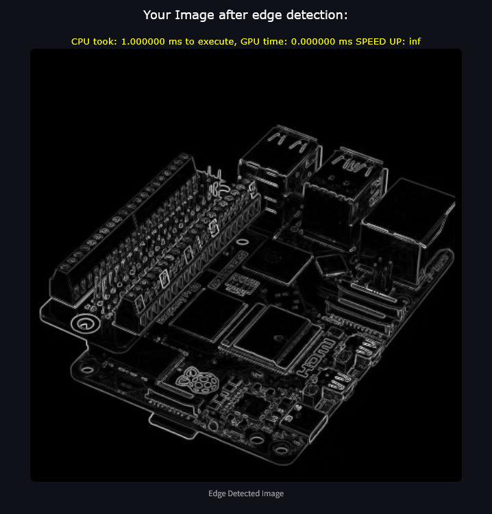

# Project Name: Edge Detection with CUDA x64


## Overview

This project demonstrates edge detection in images using CUDA. It processes an image to detect edges using a GPU-accelerated approach, leveraging CUDA for parallel computing to speed up the edge detection process. The project also includes CPU-based edge detection for comparison.

## Features

- **CUDA-accelerated edge detection** using the Sobel operator.
- **CPU-based edge detection** for benchmarking.
- Read and write grayscale PPM (P5) image files.
- Comparison of edge detection speed between CPU and GPU.

## Requirements

### Hardware Requirements

- NVIDIA GPU with CUDA support (for GPU-accelerated processing).

## Setup Instructions

### 1. Clone the repository

```bash
git clone https://github.com/yourusername/projectname.git
cd projectname
```

### 2. If you are lazy u can just run the VENV (skip downloading libraries)

```bash
WINDOWS: .\venv\Scripts\activate
MACOS: source venv/bin/activate
```

### 3. Or you can download the Python libraries using:

```bash
pip install -r requirements.txt
```

### 4. Run the streamlit app

```bash
streamlit run main.py
```

### Conclusion

- The time result depends on your GPU, in my case i have a monster overclocked GPU so almost all my tests the GPU execution time is ~0.

- There is a problem i couldn't solve, for whatever reason the kernel does not recognize the new image if i update it dynamically after inserting it with st.uploader i need to refresh the whole page such that a new image can be processed (even st.rerun() didnt work).
